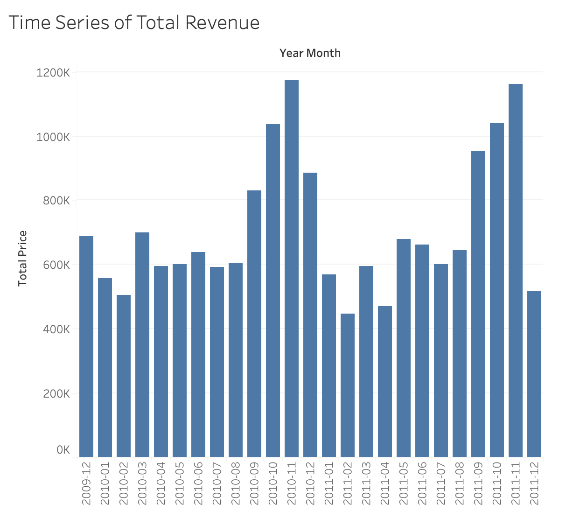
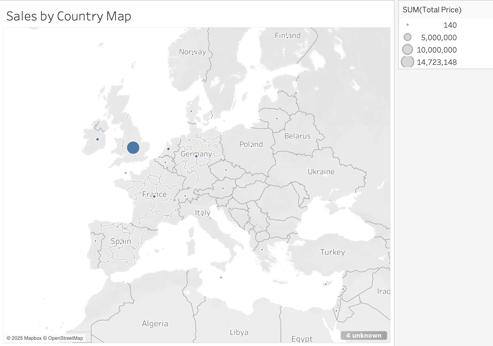
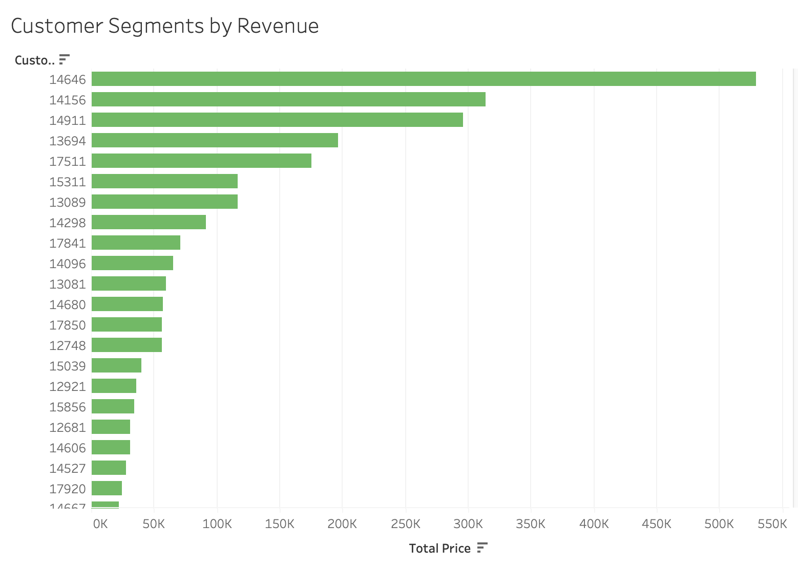
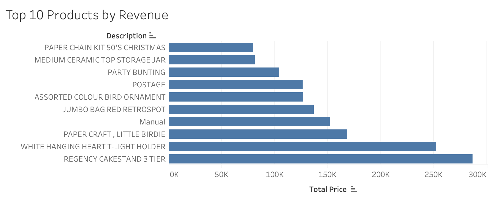
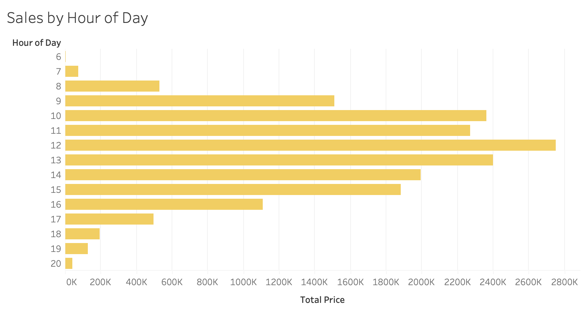
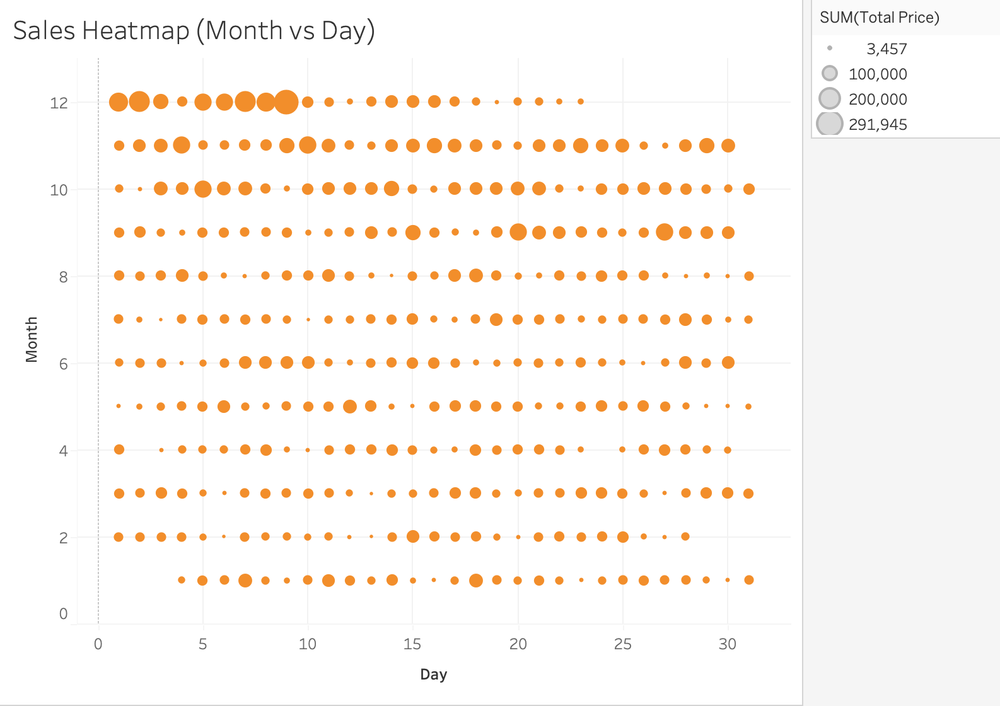

# 🛍️ Online Retail Sales Project

This project analyzes online retail transaction data and visualizes key insights using Python and Tableau. The goal is to identify trends, peak sales periods, top-selling products, and customer segments that contribute most to revenue.

---

## 📊 Project Overview

- **Dataset**: Online Retail II dataset from UCI Machine Learning Repository
- **Tools Used**:
  - Python (Pandas, Matplotlib)
  - Jupyter Notebook
  - Tableau Public

---

## 📁 Folder Structure

- `data/`: Cleaned dataset (`cleaned_online_retail.csv`)
- `notebooks/`: Jupyter notebook with data cleaning and EDA
- `tableau_screenshots/`: Final Tableau charts used in visual analysis

---

## 📌 Key Insights

### 1. 📈 Total Revenue Over Time  

### 2. 🌍 Sales by Country  

### 3. 🧍‍♂️ Top Customer Segments  

### 4. 🛒 Top 10 Products by Revenue  

### 5. ⏰ Sales by Hour of Day  

### 6. 🗓️ Heatmap: Month vs Day  

---

## 🔍 Business Questions Answered

- What time of day are sales highest?
- Which countries generate the most revenue?
- Who are the top customer segments?
- Which products generate the most income?

---

## 📬 Contact

**Meryem Camci**  
📧 meryeemcamci@gmail.com
🔗 www.linkedin.com/in/meryemcamci
